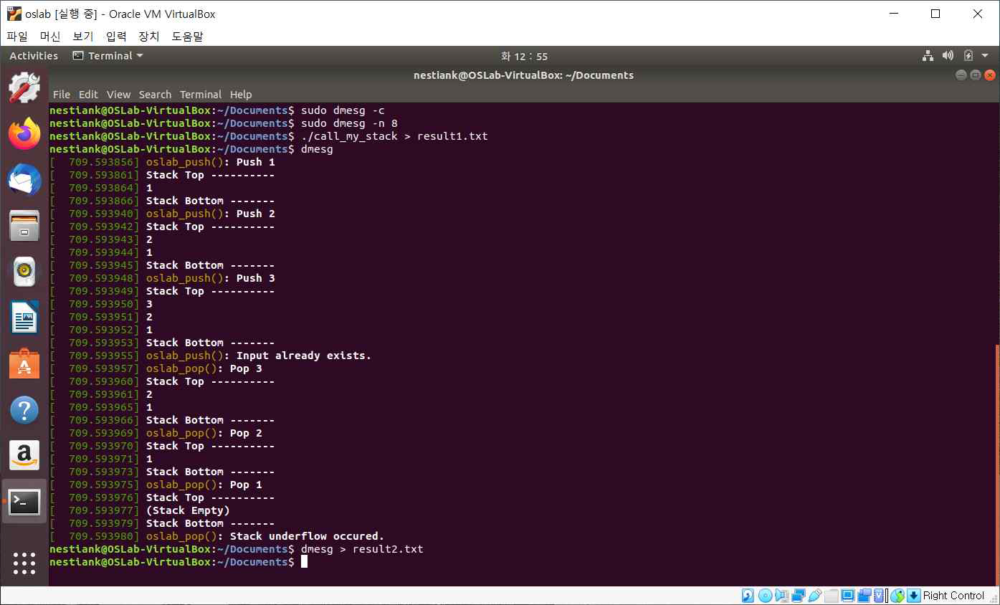

# 리눅스 커널 시스템 콜 추가

![language-c][language-c]
![platform-linux][platform-linux]
 
![participants-solo][participants-solo]
 
[![institution-korea-university][korea-university-image]][korea-university-cs-url]
![course-operating-system][course-cose341]
![grade-a+][grade-a+]

> 리눅스 커널에 스택의 기능을 하는 시스템 콜을 추가하는 프로젝트입니다.

### 스크린샷

### 작업 기간

2020년 4월

### 라이선스 및 공동체 수정

이곳은 개인 프로젝트 백업을 목적으로 하는 저장소입니다.

  * 모든 제3자 사용을 허가하지 않습니다.
  * 모든 제3자 수정을 승인하지 않습니다.
    * 깃허브 Pull Request를 받지 않습니다.

<!-- Image definitions -->
[korea-university-image]: https://img.shields.io/badge/Institution-Korea%20University-red
[korea-university-cs-url]: http://cs.korea.ac.kr
[course-cose341]: https://img.shields.io/badge/Course-Operating%20Systems-brightgreen
[language-c]: https://img.shields.io/badge/Language-C-orange
[platform-linux]: https://img.shields.io/badge/Platform-Linux-yellowgreen
[grade-a+]: https://img.shields.io/badge/Grade-A+-yellow
[participants-solo]: https://img.shields.io/badge/Participants-Solo%20Project-7aa3cc
